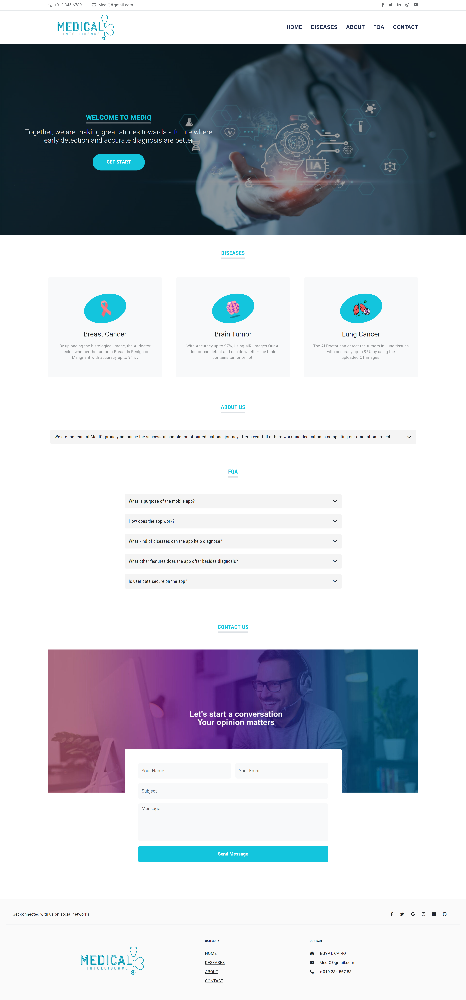
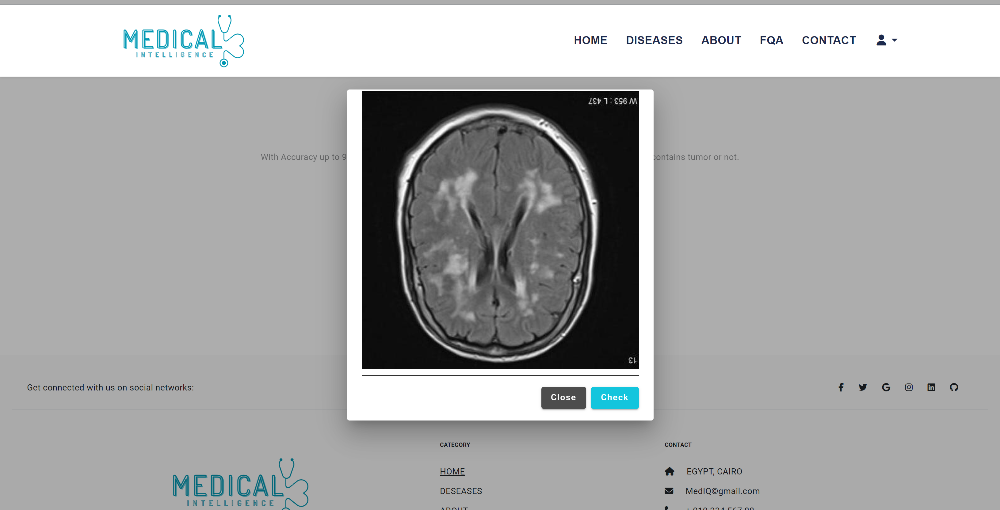
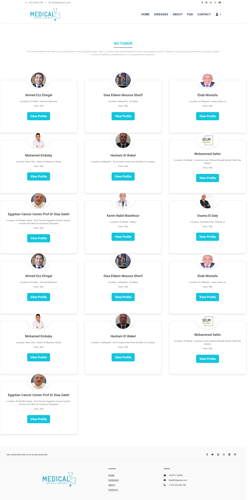
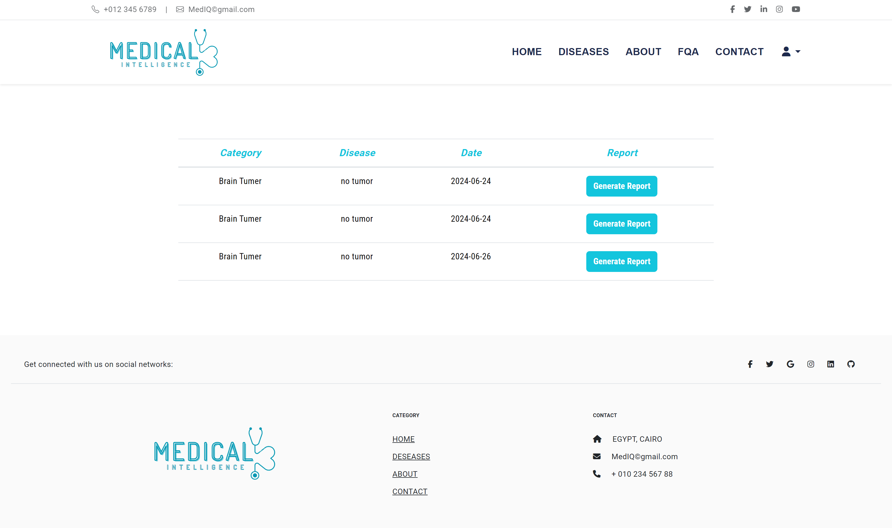

# 🎓 AI-Powered Medical Diagnostic System

🚀 **Graduation Project** – A full-stack AI-powered system to predict diseases (e.g., breast & brain cancer) from medical images using Machine Learning.

## 🔍 Project Overview

This innovative medical diagnostic platform leverages AI and machine learning to assist in the early detection of diseases through medical image analysis.

## 🧠 Key Features

- ✅ Predicts diseases like **breast, brain and Lung cancer** from uploaded images.
- 🧠 Trained ML models using **TensorFlow** and integrated with **Flask** for inference.
- 🔐 Secure backend with **Spring Boot**, **Spring Security**, and **MySQL**.
- 📱 Cross-platform UI: Web (**Angular**) + Mobile (**Flutter**).
- 📄 Automatic report generation for diagnosed images.
- 🗃️ Redis caching to improve performance and reduce server load.
- 📤 Secure image uploads and RESTful API for modularity.

## 🛠️ Tech Stack

- **AI & ML**: TensorFlow, Flask
- **Backend**: Spring Boot, Spring Security, Spring JPA, Redis, MySQL
- **Frontend**: Angular (Web), Flutter (Mobile)

## 📸 Screenshots

### 🖥️ Web UI

## 🎯 Achievements

- Deployed a working AI system for medical diagnosis
- Integrated advanced ML models into a real-time application
- Delivered seamless UX across web and mobile platforms
- Improved healthcare accessibility through automation

## 📬 Contact

For questions or collaborations, reach out via [LinkedIn](https://www.linkedin.com/in/marwan-osama-a929a125b/)
